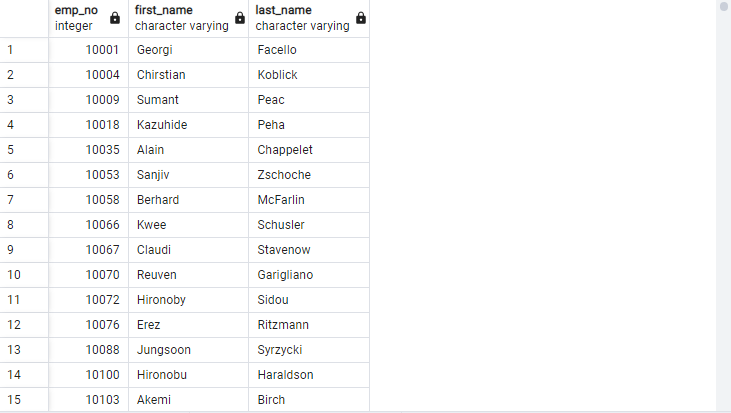
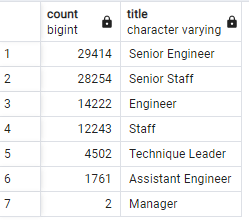
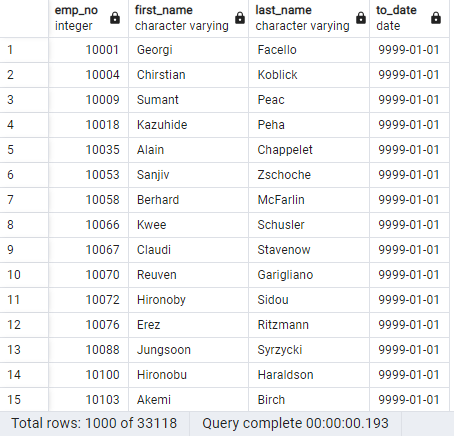
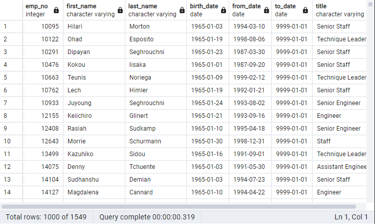

# Pewlett-Hackard-Analysis

## Overview
Pewlett-Hackard will soon have a significant number of employees retiring at once. We've been asked to determine how many total employees will be retiring, which departments have the most coming retirees and to determine whether Pewlett-Hackard has enough remaining employees to provide mentorships for new employees.

## Results
-- Our first query returned an initial total list of all upcoming retiring employees, unseparated by departments. This first result was quickly improved, however, by eliminating duplicate rows. When we run:

``` 
SELECT * FROM public.retirement_info 
```

The following list of employees is our cleaned first result: 



---------------------------------------------------------------------------------------------------------------------------------------

-- Next, we needed to determine the counts for each of the titles held by the upcoming retirees. First we created a table containing all employee titles named retirement_titles. Next, we used a DISTINCT-ON query to create a table of only unique employee titles called unique_titles. Finally, when we run:

```
-- Make the retiring_titles table
SELECT COUNT(first_name), ut.title
INTO retiring_titles
FROM unique_titles as ut 
GROUP BY (ut.title)
ORDER BY COUNT(first_name) DESC;
```

The following table counting the number of employees that will be leaving by their titles is produced:



------------------------------------------------------------------------------------------------------------------------------------------

-- Next, we needed to determine how many of PH's current (not retiring) employees are eligible for a mentorship program to replace lost labor. To do this we can first check how many employees are currently at PH by running:

```
-- Select CURRENT employees
SELECT retirement_info.emp_no, retirement_info.first_name, retirement_info.last_name, dept_emp.to_date
INTO current_emp 
FROM retirement_info 
    LEFT JOIN dept_emp
        ON retirement_info.emp_no = dept_emp.emp_no
        WHERE dept_emp.to_date = ('9999-01-01');
```

Which returns the table:



---------------------------------------------------------------------------------------------------------------------------------------------

-- Lastly, to determine how many out of the current employees are eligible for a mentorship we can run:

```
-- Find the employees who are eligible for a mentorship
SELECT DISTINCT ON (e.emp_no) e.emp_no, e.first_name, e.last_name, e.birth_date, de.from_date, de.to_date, ti.title
INTO mentorship_eligibility
FROM employees as e 
INNER JOIN dept_emp as de 
    ON (e.emp_no = de.emp_no)
INNER JOIN titles as ti 
    ON (e.emp_no = ti.emp_no)
    WHERE (e.birth_date BETWEEN '1965-01-01' AND '1965-12-31')
    AND (de.to_date = '9999-01-01')
    ORDER BY e.emp_no;
```

To produce the following final table:



## Summary & Conclusions

1. There are 90,398 employees who will become eligible for retirement at PH. PH will need to replace:
    > 29,414 senior engineers.
    > 28,254 senior staff.
    > 14,222 engineers.
    > 12,243 staff.
    > 4,502 technique leaders.
    > 1,761 assistant engineers.
    > 2 managers.


2. At a balance of almost 100k employees becoming eligible for retirement and only 1,549 current employees eligible to become a mentor, recovering PH's losses completely would require on average around 59 apprenticeships per mentor, which is clearly unreasonable. As a result of this imbalance, the 'silver tsunami' will quite  likely bring significant decreases in short-run productivity with greater long-run setbacks imminent as well due to these labor losses being heavily concentrated in senior-level positions. 


